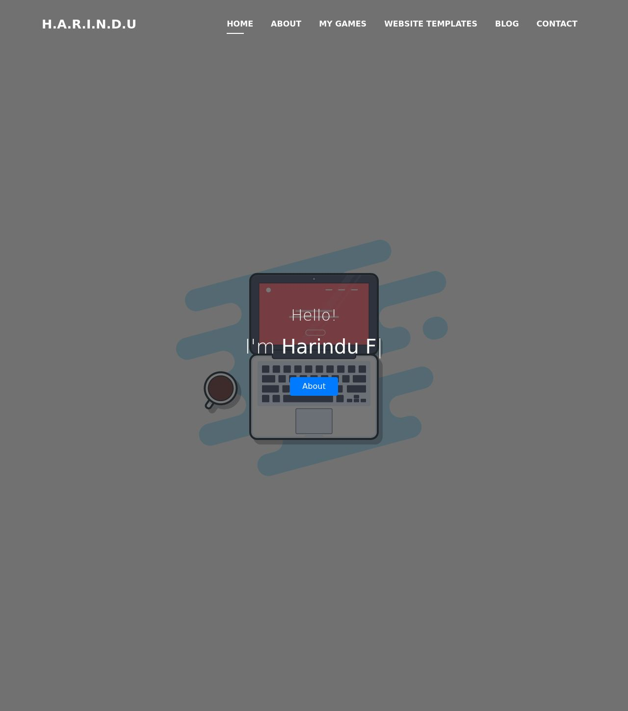

#### #Boostrap Studio #NameCheap #Canva #Iconscout #Icons8 #Github Pages
### www.harindu.dev 

### Personal website of Harindu Fonseka. Built with NameCheap, Canva, Iconscout, and Icons8. Hosted on Github Pages with .dev Domain.

<h3 align="left">Support:</h3>

  

<h3 align="left">Connect with me:</h3>

